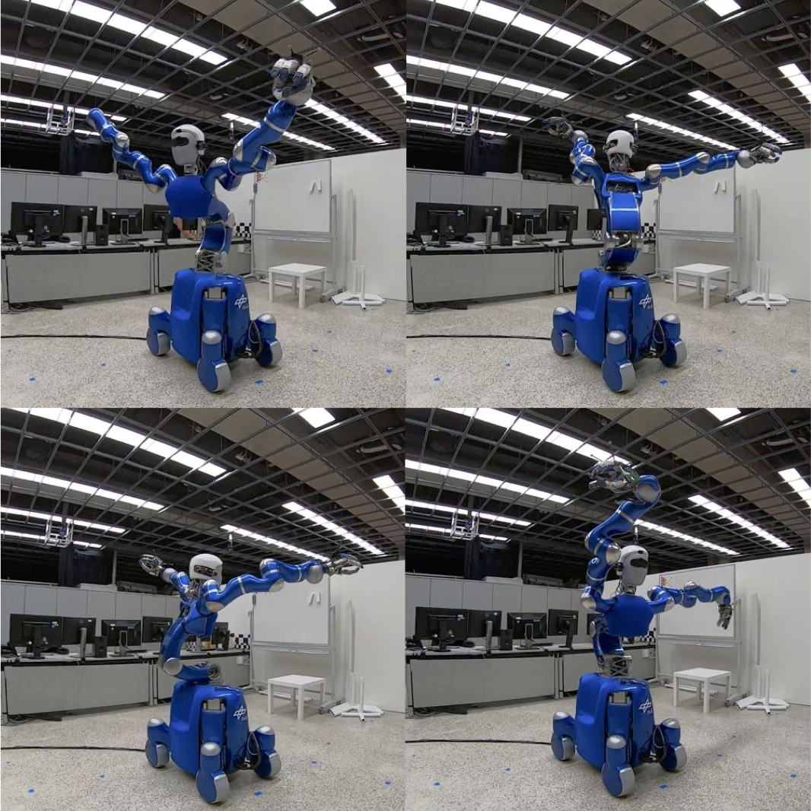

This section gives an overview of our calibration results.
We used the elastic forward kinematic model of our [previous work]().
In addition to the joint angles \\(q\\), DH-parameters \\(\rho_0\\), and elasticities\\(\kappa\\), we calibrated this time also the masses \\(\nu\\) and the camera intrinsics \\(\theta_\mathrm{C}\\).
Furthermore, we added the missing part of the kinematic chain from the torso to the head to the calibration.
Together, we calibrated the complete chain the robot uses when performing precise manipulation tasks.

{:.this
style="width: 600px;
display: block;
margin-left: auto;
margin-right: auto"}
*Distribution of the errors in image space for the three markers at the pole, the left, and the right wrist.
Calibrating only the geometric parameters (center) does not explain the elasticities in the torso seen in the pole marker.
The entire calibration (left) with geometric and non-geometric parameters distributes the remaining errors uniformly over the three markers.*

---

{:.this 
style="width: 600px; 
display: block;
margin-left: auto;
margin-right: auto"}
*We also collect measurements using the Vicon tracking system described in our [previous work]() to evaluate our approach in the cartesian space.
This external tracking system consists of six cameras mounted on the ceiling and directly tracks the cartesian position of retro-reflective markers with high accuracy.*

---

{:.this 
style="width: 600px; 
display: block;
margin-left: auto;
margin-right: auto"}
*Absolute cartesian error of the left and right arm after the full calibration.
The relative error between those two is significantly smaller, indicating that the main part of the remaining error comes from the torso.*

--- 

{:.this 
style="width: 600px; 
display: block;
margin-left: auto;
margin-right: auto"}
*Error in image and cartesian space for different calibration models with and w/o virtual noise (VN), with and w/o intrinsic camera parameters (\\(\Theta_\mathrm{C}\\)) and using only the camera (Image) or tracking system (Points).*
